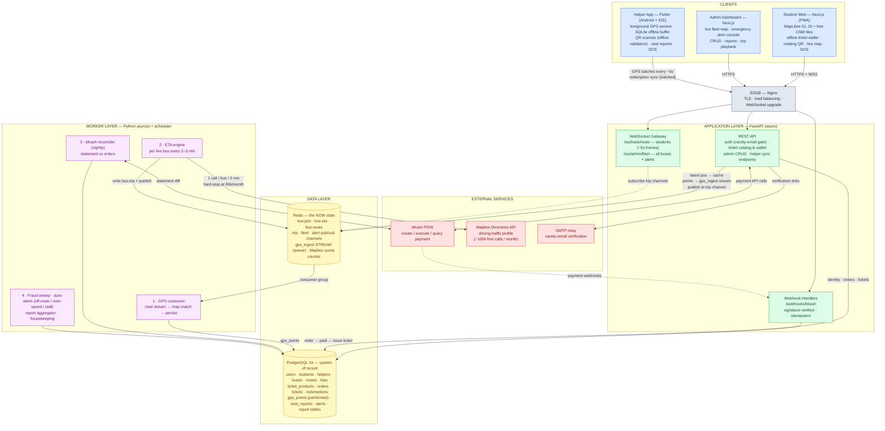
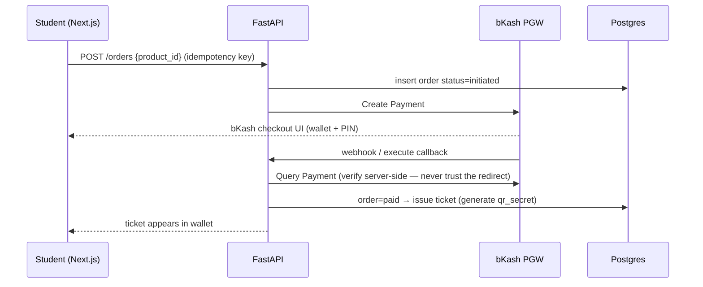

<!--
Grep-able mirror of `unitrack software specs n arch.html` (the canonical rendered doc).
Auto-extracted from that file's markdown-source; keep in sync if the HTML changes.
Agents: grep this file by section number (e.g. `## 6.`, `### 7.5`) instead of parsing the HTML.
Section index: 1 Overview · 2 Stakeholders · 3 Constraints · 4 Architecture · 5 Tech stack ·
6 Data model (+ Redis keyspace) · 7 Key flows (7.2/7.5 tickets, 7.3 tracking, 7.4 ETA, 7.6 alerts) ·
8 Auth matrix · 9 bKash · 10 Admin panel · 11 Ops · 12 Roadmap
-->

# UniTrack
### Full Project Specification & Architecture — v1.0

**Constraint-first design:** no IoT hardware on buses. The helper's smartphone is the only sensor. Revenue arrives exclusively through bKash. Bus location arrives exclusively from the helper's app.

---

## 1. Project Overview

A digital ticketing and live bus-tracking platform for a university's own bus fleet. Students buy tickets with bKash and track their bus in real time with a traffic-aware ETA. Each bus's helper acts as the "hardware": their phone streams GPS, scans student QR tickets, and reports approximate seat occupancy. Admins manage the fleet, routes, pricing, and personnel, and receive an analytics/reporting suite derived entirely from payment, ticket, and GPS data.

### Goals
1. Replace cash/paper tickets with bKash-paid digital tickets (single, bulk, and university-defined packages).
2. Give students a live map: bus position (~5 s freshness) + per-stop ETA that accounts for Dhaka traffic.
3. Give helpers a fast (<1 s), offline-capable ticket validation tool.
4. Give admins full fleet/route/pricing control and an automated reporting suite.
5. Run at near-zero third-party cost (free tiers only; no credit card dependencies).

### Non-Goals (v1)
- No hardware trackers, turnstiles, or NFC readers on buses.
- No seat *booking* — only seat-count *approximation* reported by the helper.
- No native student mobile app yet (web first; Flutter later — see Roadmap).

---

## 2. Stakeholders & User Stories

### 2.1 Student
- Registers and logs in **with their university email only** (server enforces the varsity domain allow-list, e.g. `@ulab.edu.bd`; verification link sent to that address). Profile photo is **optional** and user-uploaded.
- Buys tickets via bKash: **single ride**, **bulk** (e.g. 5/15 rides), or **package** (e.g. 20/40 rides) — products and prices defined by admin.
- Sees live bus position on a map, updated every ~5 s over WebSocket.
- Sees traffic-aware ETA for each upcoming stop of their route.
- Sees approximate seats available (helper's latest report vs bus capacity).
- Holds a digital ticket wallet; shows a rotating QR at boarding — **works with zero internet** (Section 7.5).
- Can raise an **emergency report** from the live route screen (rate-limited; tied to the verified varsity account).

### 2.2 Helper
- Registers with any email/phone (varsity mail **not** required); account stays **pending until an admin approves it**.
- Runs the Flutter app during a trip: streams GPS every 3–5 s (buffered offline, batch-synced).
- Scans and validates student QR tickets — works fully offline.
- Submits seat-occupancy estimates with one tap (e.g. "~30 seated / standing / full").
- Starts/ends trips, which anchors all GPS and redemption data to a trip record.
- One-tap **SOS / incident report** (breakdown, accident, harassment) attached to the live trip — priority-queued offline like everything else.

### 2.3 Admin
- Operates the full admin panel (Section 10): KPI dashboard, live fleet monitoring, revenue, ridership analytics, management, wallet & transactions, emergency alert console, trip history.
- Manages buses, routes & stops, schedules, ticket products & prices; approves/suspends helpers and assigns them to buses; searches/suspends students.
- Receives emergency alerts raised by helpers and students, plus **system-generated** alerts (off-route, over-speed, long stall, GPS blackout).
- Seeded account; additional admins created by invite. Varsity mail not required.

---

## 3. Constraints & Design Assumptions

| Constraint | Design consequence |
|---|---|
| No IoT devices on buses | Helper phone = GPS source, ticket scanner, and occupancy sensor. All flows must survive that phone being offline or dying. |
| Revenue only via bKash | Payment webhook is the single money-truth source; nightly reconciliation is mandatory. |
| Students verified only by varsity email | Email-domain allow-list + verification link is the entire identity gate. Optional photo shown to helper is a soft check, not enforcement. |
| No credit card available | Traffic ETA via **Mapbox Directions free tier** (accepts debit cards if verification is requested; ~100k req/month free). Map tiles via **MapLibre GL JS + free OSM tiles** (zero quota). |
| Dhaka traffic | Static schedule alone is useless for ETA; live traffic-aware routing required (Section 8). |

---

## 4. System Architecture

### 4.1 Master diagram (deep breakdown)



> Solid arrows = request/write paths · dotted arrows = event/subscription paths. The same diagram lives in `architecture.mermaid` as a standalone file.

### 4.2 Golden rules encoded in this diagram
1. **Clients never touch Postgres, Redis, or the worker directly** — everything passes through FastAPI.
2. **Redis holds "now"** (positions, ETAs, seats); **Postgres holds "forever"** (history, money, identity).
3. **All third-party calls are server-side** (bKash, Mapbox, SMTP) — quotas and secrets never reach a browser or the helper app.
4. **The queue (Redis Stream) decouples ingestion from persistence**, so a slow DB write never delays a live position update.

---

## 5. Tech Stack — Component by Component

| Layer | Technology | Why / notes |
|---|---|---|
| Student frontend | **Next.js** (App Router) + **MapLibre GL JS** + free OSM tiles (OpenFreeMap) | Web-first; MapLibre keeps map display 100% free & unmetered. PWA (service worker + IndexedDB ticket wallet) so tickets and the rotating QR work fully offline — see 7.5. Future: Flutter app reuses the same API. |
| Admin frontend | **Next.js** + a table/chart lib (e.g. Recharts) | CRUD dashboards + report visualizations. Server components for report pages. |
| Helper app | **Flutter** (Android + iOS) | One codebase. Android **foreground service** for uninterrupted GPS; `mobile_scanner` for QR; **SQLite (drift)** for offline buffers; background sync on reconnect. |
| API | **FastAPI (async)** + Uvicorn, SQLAlchemy 2.0 async + asyncpg, Pydantic v2 | REST + native WebSocket support in one framework. JWT auth (access+refresh), role-based guards. |
| Worker | **Python asyncio** service (same repo, separate process) + APScheduler for cron jobs | Consumes Redis Streams via consumer groups; runs scheduled jobs. Scales by adding consumers. |
| Cache / realtime / queue | **Redis** (single instance, AOF persistence) | Latest-state cache, pub/sub fan-out, Streams as the ingest queue, rate counters. Replaces Elasticsearch for v1 (see 5.1). |
| Database | **PostgreSQL 16** | System of record. `gps_points` partitioned monthly. PostGIS optional later for geo queries. |
| Traffic/ETA | **Mapbox Directions API**, `driving-traffic` profile | Live+typical traffic coverage includes Bangladesh; ~100k free calls/month ≈ 13+ buses polled every 3 min. |
| Payments | **bKash Checkout (PGW) API** | Create → execute → query payment; webhook + nightly reconciliation. |
| Email | Any free SMTP relay tier | Only for varsity-email verification links + password reset. |
| Deploy | Docker Compose on a single VPS (nginx, api, worker, redis, postgres) | Entire v1 fits on one 2–4 GB VPS. Split later if needed. |

### 5.1 Why Elasticsearch was dropped from v1
ES was originally slotted for GPS data, but a university fleet emits tiny data volumes (≈20 buses × 1 point/4 s ≈ 400k points/day) that Postgres handles trivially, and students only ever query "latest position," which Redis answers in microseconds. ES adds JVM memory cost and ops burden with no v1 payoff. **Revisit** only if you later want free-text log analytics or heavy geo-aggregation dashboards.

---

## 6. Data Model (PostgreSQL)

> Naming: snake_case; all tables have `id UUID PK`, `created_at`, `updated_at` unless noted.

**Identity & roles**
- `users` — email (unique), password_hash, role ENUM(`student`,`helper`,`admin`), phone, name, photo_url (nullable), status ENUM(`pending_email`,`active`,`pending_approval`,`suspended`).
- `students` — user_id FK, student_id_no, department, batch, default_stop_id (nullable). *Created only for emails matching the varsity domain allow-list.*
- `helpers` — user_id FK, approved_by (admin user_id, nullable until approved), status ENUM(`pending`,`approved`,`suspended`), current_device_id.

**Fleet & routing**
- `buses` — reg_no, nickname, capacity, status.
- `stops` — name, lat, lng.
- `routes` — name, direction, polyline (encoded), active.
- `route_stops` — route_id, stop_id, seq, scheduled_offset_min (minutes from trip start).
- `schedules` — route_id, days_of_week, departure_time, default_bus_id, default_helper_id.
- `trips` — schedule_id, route_id, bus_id, helper_id, service_date, scheduled_start, actual_start, actual_end, status ENUM(`scheduled`,`live`,`completed`,`cancelled`). **Every GPS point, redemption, and seat report hangs off a trip.**

**Commerce**
- `ticket_products` — type ENUM(`single`,`bulk`,`package`), name, price_bdt, ride_count (null = unlimited), validity_days, route_scope (null = all routes), active.
- `orders` — student_id, product_id, amount_bdt, bkash_payment_id, bkash_trx_id, status ENUM(`initiated`,`pending`,`paid`,`failed`,`refunded`), idempotency_key (unique), raw_webhook JSONB.
- `tickets` — order_id, student_id, product_id, rides_total, rides_remaining, valid_from, valid_to, **qr_secret** (per-ticket HMAC key for rotating QR), status ENUM(`active`,`exhausted`,`expired`,`revoked`).
- `redemptions` — ticket_id, trip_id, helper_device_id, nonce (unique **per device** at write time; global uniqueness enforced by fraud sweep), passenger_count, redeemed_at (device clock), synced_at, flag ENUM(`ok`,`duplicate_suspect`,`invalid`).

**Telemetry**
- `gps_points` *(partitioned by month)* — trip_id, bus_id, ts, lat, lng, speed, heading, accuracy, matched_route_pct (nullable; filled by worker).
- `seat_reports` — trip_id, helper_id, ts, occupied_estimate, capacity_snapshot.

**Safety & governance**
- `alerts` — source ENUM(`helper`,`student`,`system`), raised_by (user_id, null for system), trip_id, bus_id, route_id (nullable), type ENUM(`sos`,`breakdown`,`accident`,`harassment`,`overcrowding`,`off_route`,`over_speed`,`stall`,`gps_blackout`,`other`), severity ENUM(`critical`,`warning`,`info`), message, lat, lng, status ENUM(`open`,`acknowledged`,`resolved`,`dismissed`), acknowledged_by, resolved_note, resolved_at.
- `audit_logs` — actor_id, action, entity, entity_id, diff JSONB — written on every admin mutation.

**Reporting (materialized by worker)**
- `daily_route_stats`, `daily_revenue_stats`, `helper_daily_stats`, `trip_summaries` — pre-aggregated so admin dashboards never scan raw tables.

**Redis keyspace**
```
bus:{bus_id}:pos      HASH  {lat, lng, speed, heading, ts, trip_id}     TTL 60s
bus:{bus_id}:eta      JSON  [{stop_id, eta_ts, delay_min}, ...]         TTL 300s
bus:{bus_id}:seats    HASH  {occupied, capacity, ts}                    TTL 900s
trip:{trip_id}:ch     PUBSUB channel (position+eta+seats fan-out)
gps_ingest            STREAM (consumer group: workers)
fleet:ch              PUBSUB (all-bus positions → admin live map)
alerts:ch             PUBSUB (new/updated alerts → admin console)
mapbox:calls:{yyyymm} INT counter — hard-stop guard at 90,000
```

---

## 7. Key Flows

### 7.1 Ticket purchase (bKash)


Rules: order creation is **idempotent**; the ticket is issued **only** after a server-side Query Payment confirms `Completed`; every raw webhook body is stored for the nightly reconciler.

### 7.2 Boarding validation (offline-first)
1. Student opens ticket → app renders QR = `ticket_id . passenger_count . time_slice . nonce . HMAC(qr_secret, payload)`; the QR **re-signs every ~30 s** (TOTP-style), so screenshots go stale.
2. Helper app scans → verifies HMAC with the ticket's public verification material synced earlier → checks time_slice window (±1 slice for clock skew) → checks **local SQLite redemption log** for nonce reuse → big green/red screen + name/photo (if provided) + "✓ N passengers".
3. Redemption is queued locally and synced when online; server decrements `rides_remaining`.
4. **Fraud sweep** (worker): same nonce redeemed on two different helper devices → flag both redemptions, notify admin, optionally suspend the ticket. Cryptography closes same-device replay; detection + consequences close the cross-device gap that offline validation inherently leaves.

### 7.3 Live tracking pipeline (5-second loop)
1. Helper app buffers GPS to SQLite; POSTs a batch (1–10 points) every ~5 s to `/helper/trips/{id}/gps`.
2. FastAPI: writes newest point to `bus:{id}:pos`, publishes to `trip:{id}:ch` **and** `fleet:ch` (admin live map), and `XADD`s all points to `gps_ingest`.
3. Worker consumes the stream → map-matches to the route polyline → persists to `gps_points`.
4. Students connected to `/ws/track/{route_id}` receive every publish: position + ETA + seat estimate in one frame.

### 7.4 Traffic-aware ETA (Dhaka-proof)
1. Every 2–3 min per **live** trip, the worker calls Mapbox Directions (`driving-traffic`) from the bus's current snapped position through the remaining stops (waypoints).
2. Response durations → per-stop ETA + delay vs schedule → cached in `bus:{id}:eta` → published.
3. Guard rails: monthly counter hard-stops at 90k calls; on failure, fall back to schedule offset adjusted by the bus's rolling average speed (labelled "estimated").
4. Budget: 1 trip polled every 3 min × 12 h × 30 days ≈ 7.2k calls → **~13 concurrent buses ride free**; poll every 5 min → ~23 buses.

---

### 7.5 Offline ticket operation (zero-internet boarding)

**Design goal:** a paid ticket must be usable when the *student's* phone has no internet, the *helper's* phone has no internet, or both. Boarding never depends on live connectivity.

**Student side — the PWA offline wallet**
- The student frontend ships as a **PWA**: a service worker caches the app shell, so the wallet opens with no network at all.
- On every purchase and every successful sync, active tickets are written to **IndexedDB**: `ticket_id`, product info, `rides_remaining` (last-known snapshot), validity window, `passenger_count`, and the ticket's **`qr_secret`**.
- A **clock offset** (`server_time − device_time`) is stored at each sync; all QR time slices are computed with the corrected clock, so a wrong phone clock doesn't break boarding.
- The rotating QR is generated **entirely on-device**: `ticket_id · passenger_count · time_slice(30s) · nonce · HMAC(qr_secret, payload)` — identical bytes to the online rendering. Rotation is clock-driven (TOTP-style), not server-pushed, so it keeps rotating offline.

**Helper side — offline acceptance + ticket manifest**
- HMAC check, time-slice check (±1 slice skew tolerance), and the local SQLite **nonce log** all run offline, as in 7.2.
- Additionally, the helper app periodically syncs a compact **ticket manifest**: `ticket_id`, `student_id_no`, name, cached photo, `rides_remaining` snapshot, `status`. Typical sync point: trip start, on depot WiFi or mobile data. The manifest enables:
  - **Dead-phone fallback:** a student whose phone is dead or cache-cleared gives their student ID; the helper looks it up in the manifest, confirms the name/photo, and records a **manual redemption** against the ticket — same nonce log, same later sync.
  - **Offline revocation:** tickets revoked/exhausted since the helper's last sync are rejected even though the helper is offline. Revocation is *eventually consistent*: the staleness window equals the helper's last manifest sync.

**Sync & consistency rules**
- `rides_remaining` on the student device is **advisory**; the server value is authoritative and corrected at the next sync.
- Redemptions queue locally on the helper device and sync in batches; the server decrements rides and returns updated ticket states.
- If offline redemptions across two helper devices push a ticket past zero rides, the fraud sweep flags it, the ticket auto-suspends, and the admin is notified — the deliberate trade-off for allowing fully offline validation.

| Failure mode | What happens |
|---|---|
| Student offline, helper online | QR generated from cache; validated normally. |
| Student online, helper offline | QR validated locally (HMAC + nonce log); redemption syncs later. |
| Both offline | Fully local validation; both sides reconcile on next signal. |
| Student's phone dead / cache cleared | Manifest lookup by student ID → manual redemption. |
| Device clock badly wrong | Corrected by stored clock offset; ±1 slice tolerance absorbs residual skew. |
| Ticket revoked while helper offline | Rejected if revoked before helper's last manifest sync; otherwise caught at reconciliation. |

**Accepted security trade-off:** storing `qr_secret` client-side means a determined student could extract it. Mitigations are the per-device nonce log, the cross-device fraud sweep, ticket revocation, and account penalties (see 7.2). Offline capability is exactly what makes these backend defenses mandatory rather than optional.

*(Future safety valve, not v1: bKash's `*247#` USSD "Pay Merchant" allows offline purchase into the merchant wallet with a student-ID reference, matched later by the reconciler.)*

### 7.6 Emergency alert flow
1. **Raise** — Helper: one-tap SOS on the trip screen (breakdown / accident / harassment / other); the app auto-attaches trip, bus, and last GPS fix, and if offline the alert is **priority-queued** ahead of GPS batches. Student: "report emergency" on the live route screen (needs connectivity; rate-limited per account).
2. **Fan-out** — FastAPI persists to `alerts` and publishes to `alerts:ch`; every admin console on `/ws/admin/fleet` shows it instantly. `critical` severity additionally emails all admins.
3. **Handle** — Admin acknowledges (status change broadcast back to the raiser), then resolves with a note; the alert attaches permanently to the trip's history.
4. **System-generated** — the worker raises automatic alerts from the GPS stream: off-route beyond a threshold, sustained over-speed, stall > N minutes vs schedule, GPS blackout mid-trip (doubles as helper accountability).
5. **Abuse control** — student alerts are tied to the verified varsity account and rate-limited; repeated false alarms → suspension. Helper SOS is never rate-limited.

## 8. Auth & Access Matrix

| Capability | Student | Helper | Admin |
|---|---|---|---|
| Register | varsity-email only, email-verify link | any email/phone → **admin approval** | invite-only |
| Buy tickets / wallet | ✔ | ✖ | ✖ |
| Live map + ETA | ✔ (their routes) | ✔ (own trip) | ✔ (whole fleet) |
| Stream GPS / seat reports | ✖ | ✔ (own trip, approved only) | ✖ |
| Validate tickets | ✖ | ✔ | ✖ |
| Raise emergency alert | ✔ (active route, rate-limited) | ✔ (one-tap SOS, offline-queued) | manage · ack · resolve |
| CRUD buses/routes/prices/helpers | ✖ | ✖ | ✔ |
| Reports | ✖ | own stats | ✔ all |

Implementation: JWT access (15 min) + refresh (30 d) tokens; role claim checked by FastAPI dependency guards; helper endpoints additionally require `helpers.status='approved'`; student **signup rejects any email outside the configured domain list at the API layer** (not just the UI).

---

## 9. bKash Integration Notes
- Use the **PGW Checkout** flow: Grant Token → Create Payment → customer authorizes in bKash UI → Execute Payment → **Query Payment** as final truth.
- Webhooks: verify signature/credentials, respond fast, process async, and make handling **idempotent** (bKash can deliver duplicates).
- Store `paymentID` and `trxID` on the order; the nightly reconciler diffs the PGW statement against `orders` and flags: paid-but-no-ticket, ticket-but-no-payment, amount mismatches, refunds.
- Sandbox first; production credentials require the university's merchant account.

---

## 10. Admin Panel — Modules & Reporting (no IoT required for any of it)

### 10.1 Dashboard (landing view)
Today-at-a-glance KPIs, each linking into its module: revenue so far today, buses live right now, tickets validated today, open alerts, fleet on-time %. Live values come from Redis; aggregates from the materialized report tables — the dashboard never scans raw tables.

### 10.2 Live fleet monitoring
Every active bus on one MapLibre map via `/ws/admin/fleet` (subscribed to `fleet:ch` + `alerts:ch`): position, heading, delay vs schedule, occupancy estimate, and a **GPS-freshness indicator** (no fix for >60 s = helper connectivity problem, shown amber). Clicking a bus opens a trip drawer: helper, route progress %, latest redemptions, seat reports.

### 10.3 Revenue
Revenue by day/week/month × route × bus × product type; package uptake & renewal rates; failed-payment and refund analysis; CSV export.

### 10.4 Ridership
Occupancy trends (helper estimates vs capacity), **peak-hour curves**, **passengers per route/trip/hour** (from validations), and the sold-vs-validated gap (no-show / skipped-validation indicator).

### 10.5 Management
Full CRUD: buses, stops, routes (polyline editor), schedules, ticket products & pricing. Helper approval / suspension / bus assignment. Student directory (search, view profile, suspend). Admin invites. **Every mutation writes an `audit_logs` entry.**

### 10.6 Wallet & transactions
Order browser searchable by student, bKash `trxID`, or status; drill into the raw stored webhook payload; initiate refunds (bKash refund API); and a **reconciliation exception queue** (paid-but-no-ticket, ticket-but-no-payment, amount mismatch) fed by the nightly reconciler.

### 10.7 Emergency alerts
Live console fed by `alerts:ch`. Three sources: helper one-tap SOS (offline-capable, priority-synced), student reports from the live route screen (rate-limited), and system-generated alerts from the worker (off-route, over-speed, stall, GPS blackout). Lifecycle: **open → acknowledged → resolved (with note)**; critical alerts also email all admins. Full flow in 7.6.

### 10.8 Trip history
Searchable `trip_summaries` (route, bus, helper, date, delay). Drilling into a trip gives **GPS trail playback** on the map (animated from `gps_points`), the redemption list, the seat-report timeline, and any alerts raised during that trip.

### 10.9 Derived extras (free insights from data already collected)
Helper scorecards (GPS uptime %, on-time starts, redemptions handled); fraud dashboard (duplicate-nonce flags, negative-ride tickets, suspicious sold-vs-validated gaps); per-device GPS data-quality report; demand-vs-capacity heatmap (route × hour) to drive bus reallocation; delay distribution per route and time-of-day; full admin audit trail; CSV export on every module.

## 11. Non-Functional & Ops
- **Scale envelope (v1):** ≤ ~30 buses, ≤ ~10k students, ≤ ~2k concurrent WebSocket clients — one FastAPI pod + one worker on a 2–4 GB VPS handles this; Redis pub/sub already makes multi-pod fan-out work when you scale.
- **Security:** HTTPS everywhere; bcrypt/argon2 password hashing; webhook signature checks; per-role rate limits; helper app device-ID binding; secrets in env, never in clients.
- **Resilience:** student offline → PWA wallet renders the rotating QR from cached `qr_secret`; helper offline → GPS, redemptions & manifest checks run locally; Redis down → tracking degrades but money paths (Postgres) unaffected; Mapbox down → schedule-based ETA fallback.
- **Backups:** nightly `pg_dump` off-box; Redis AOF for restart safety (Redis data is reconstructible anyway).

---

## 12. Roadmap
1. **P1 — Money & identity:** auth (varsity-email gate), product catalog, bKash purchase, ticket wallet, admin CRUD.
2. **P2 — Live ops:** helper app (GPS foreground service + trip lifecycle), tracking pipeline, WebSocket map, seat reports, **admin live fleet map**.
3. **P3 — Validation & ETA:** rotating QR + offline validation + fraud sweep; Mapbox ETA engine.
4. **P4 — Reports & polish:** materialized report tables, admin dashboard + all panel modules, reconciliation automation, **emergency alert system** (manual + system-generated).
5. **P5 — Future:** Flutter student app (same API), push notifications ("bus 10 min away"), PostGIS/analytics upgrades, optional ES if analytics outgrow Postgres.